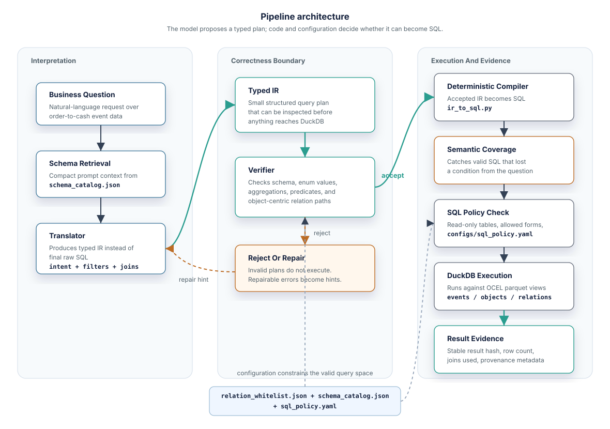
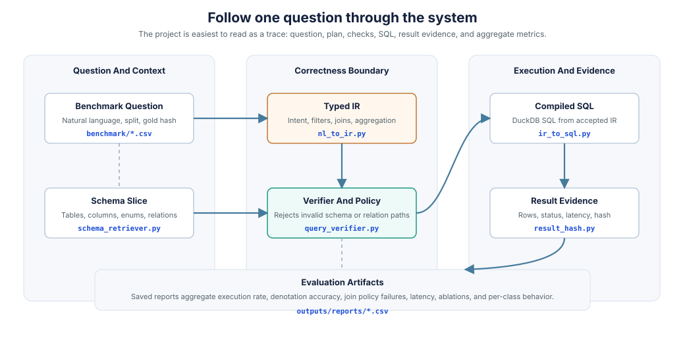
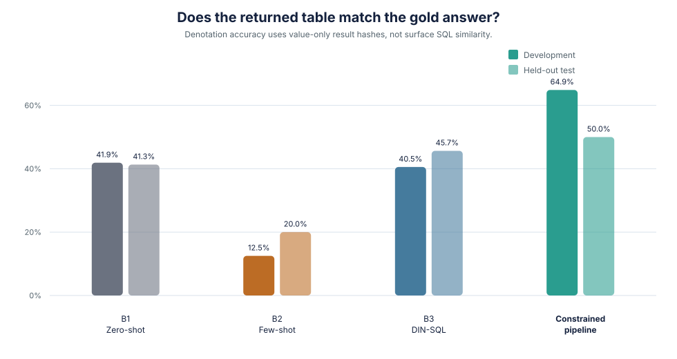
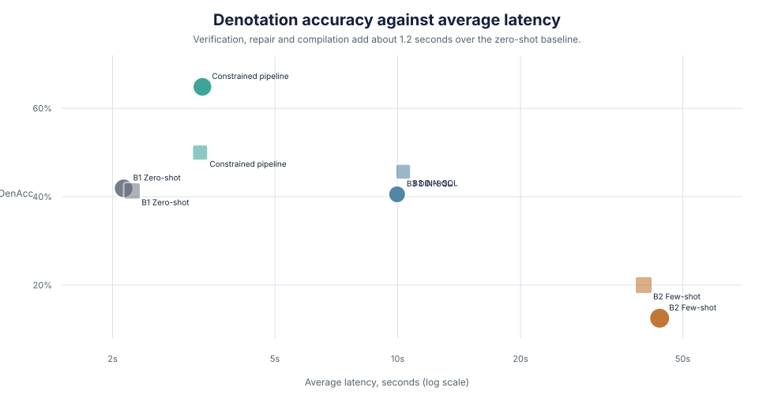
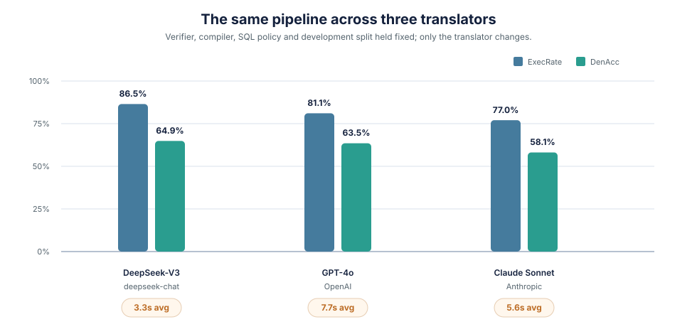
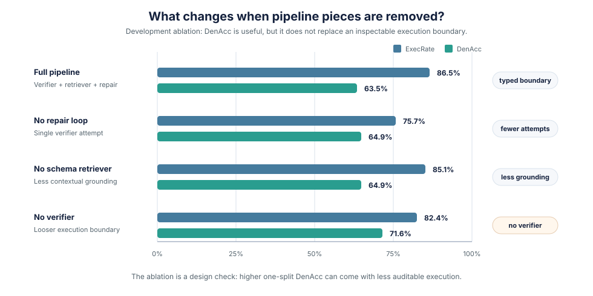
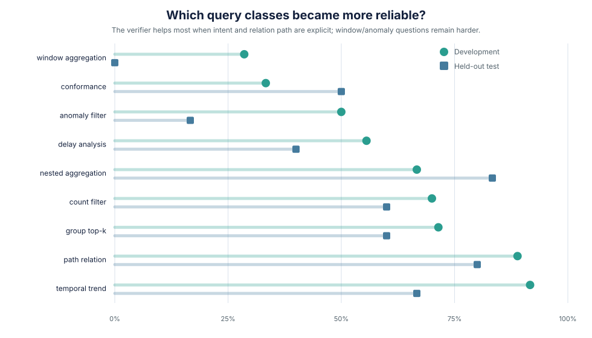

## Overview

A text-to-SQL system that fails loudly is easy to work with. The query names a
column that does not exist, the database raises an error, and nothing downstream
believes the result.

The failure that matters here is the silent one. On an object-centric event log,
a query can join through the wrong path between business objects, execute
cleanly, and return a plausible number that answers a different question than
the one asked. No error is raised, because nothing in a normal stack is checking
which path was taken.

This project removes SQL generation from the language model. The model proposes
a typed intermediate representation; deterministic code verifies that IR against
a schema catalog, a relation whitelist and a SQL policy; and only then does a
compiler assemble the query text. Anything the verifier rejects never reaches
the database.

Measured against three published prompting strategies on the same backend and
the same 120 questions, that architecture gains 23 points of denotation accuracy
on the development split and holds relation-path violations at zero.

[Browse the repository](https://github.com/O-2wice/correctness-aware-nl-query-translation-ocel)
&nbsp;
[Open the results notebook](https://github.com/O-2wice/correctness-aware-nl-query-translation-ocel/blob/main/notebooks/03_results.ipynb)

## The Data Shape

The query target is an **object-centric event log (OCEL 2.0)** built from an
order-to-cash process. A conventional event log flattens a process into one case
per row, which forces a choice of single case notion and loses everything that
does not fit it. OCEL keeps events, business objects, and the typed relations
between objects as first-class records, so an order item, the customer it
belongs to and the billing document it produced stay distinct and separately
addressable.

The log is exposed to DuckDB as three views over parquet files.

| View | Contents |
| --- | --- |
| `events` | Event type, timestamp, and the object the event happened to. |
| `objects` | Order items, customers, billing documents, deliveries, AR items, materials. |
| `relations` | Typed links between objects, such as `order_to_customer` and `billing_to_ar`. |

The relations view is what separates this from a conventional text-to-SQL
benchmark. There, the difficulty is finding the right columns. Here the columns
are few and the difficulty is choosing the right path between objects:

```text
order_item --order_to_customer--> customer --event--> dunning_raised
order_item --order_to_billing--> billing_doc --billing_to_ar--> ar_item
```

A question about customers who received a dunning notice needs the first path. A
question about payment clearing needs the second. Both paths are joinable, both
produce a count, and only one of them answers the question. Nothing about the
result distinguishes them.

## Why the Model Does Not Write SQL

The usual response is to strengthen the prompt: add the schema, add worked
examples, add a self-correction pass. All three are represented in the baselines
below, and all three still emit a SQL string that has to be trusted as written.

The alternative is to constrain what the model is allowed to produce. Its output
is a typed plan in JSON, and never a query.

```json
{
  "intent": "path_relation",
  "tables": ["objects", "relations", "events"],
  "select": [
    {
      "col": "object_id",
      "agg": "COUNT",
      "alias": "n_orders_with_dunning_customer",
      "distinct": true
    }
  ],
  "filters": [
    {"table": "objects", "col": "object_type", "op": "=", "val": "order_item"},
    {"table": "events", "col": "event_type", "op": "=", "val": "dunning_raised"}
  ],
  "joins": [
    {"relation_type": "order_to_customer"}
  ]
}
```

Structured this way, the plan is checkable by ordinary code. Whether
`order_to_customer` is a real relation type, whether `dunning_raised` appears in
the enum for `event_type`, whether `COUNT DISTINCT` is permitted for this intent:
each is a lookup with a definite answer. The same questions asked of a finished
SQL string require parsing it and inferring intent.

`verify_ir` returns one of three verdicts. `accept` passes the plan to the
compiler. `repair` means the errors are fixable by substitution, so the specific
violations go back to the model as hints and it tries again, up to two repair
attempts. `reject` means the plan is structurally broken and the question is
abandoned. Returning nothing is a better outcome than returning a number that
cannot be justified.

Only after that verdict does any SQL text exist. `ir_to_sql.py` assembles the
query from fixed clause builders and per-intent templates, with nothing
generative involved, so the same accepted plan always compiles to byte-identical
SQL. The compiler also refuses to emit a join for any relation type outside the
whitelist, which means an illegal object path cannot survive compilation even if
it had survived verification. DuckDB then executes that string against the three
OCEL views.



## What the Verifier Checks

Enforcement lives in configuration and code rather than in prompt wording.

| Layer | Where | What it rejects |
| --- | --- | --- |
| Schema catalog | `configs/schema_catalog.json` | Tables, columns, event types and object types that do not exist. |
| Relation whitelist | `configs/relation_whitelist.json` | Joins along object paths absent from the log. |
| IR verifier | `src/nl2ocel/query_verifier.py` | Invalid intents, predicates, aggregations and relation paths. |
| Semantic coverage | `src/nl2ocel/semantic_coverage.py` | Schema-valid plans that drop a condition the question asked for. |
| SQL policy | `configs/sql_policy.yaml` | Writes and DDL, unapproved base tables, aggregations and predicates, unbounded raw selects. |
| Result hashing | `src/nl2ocel/result_hash.py` | Alias and row-order differences when comparing answers. |

The semantic coverage stage is the least obvious and catches a specific failure:
a plan that is entirely valid against the schema but has quietly lost part of
the question. A query about order items linked to customers who received a
dunning notice can compile perfectly while counting all customer-linked order
items. It runs, it returns a number, and the dunning condition has vanished.
That check runs after compilation and before execution.

## A Worked Example

One of the benchmark questions:

> How many order items are linked to a customer that received a dunning notice?

The accepted plan compiles to:

```sql
SELECT COUNT(DISTINCT o.object_id) AS n_orders_with_dunning_customer
FROM objects o
WHERE o.object_type = 'order_item'
  AND EXISTS (
    SELECT 1
    FROM relations r
    JOIN events e ON e.object_id = r.to_object_id
    WHERE r.from_object_id = o.object_id
      AND r.relation_type = 'order_to_customer'
      AND e.event_type = 'dunning_raised'
  )
```

The `relation_type` filter is present because the compiler refuses to emit a
join for a relation absent from the whitelist. Execution returns one row, which
is hashed and compared against the stored gold hash for that question.

Each stage keeps its artifact: schema slice, IR, compiled SQL, status, latency,
result hash. An answer can be taken apart afterwards.



## Evaluation

Answers are scored by denotation: execute the generated SQL, hash the returned
values, compare against the gold hash. Resemblance to a reference query string
counts for nothing, and two queries with no textual similarity that return the
same table are both correct.

The baselines are three published prompting strategies, run on the same backend
so the comparison reflects architecture rather than model quality. B1 is
zero-shot Create Table + Select 3 prompting (Rajkumar). B2 is few-shot with
similarity-diversity example selection (Nan). B3 is the four-stage DIN-SQL flow
(Pourreza).

They are reimplemented here rather than approximated, which is most of the work
in the comparison: `nan_sampler.py` builds B2's demonstration pool by balancing
question similarity against structural diversity and excludes its own seed
questions from scoring, and `din_sql_demos.py` carries B3's staged
demonstrations with per-stage token caps and stop sequences. A baseline that
loses because it was implemented carelessly proves nothing, so the effort went
into making them hard to beat.



| Split | Method | n | ExecRate | DenAcc | JoinHall | Avg latency |
| --- | --- | ---: | ---: | ---: | ---: | ---: |
| Dev | B1 Zero-shot | 74 | 86.5% | 41.9% | 1.4% | 2.1s |
| Dev | B2 Few-shot | 72 | 100.0% | 12.5% | 0.0% | 43.9s |
| Dev | B3 DIN-SQL | 74 | 66.2% | 40.5% | 0.0% | 10.0s |
| Dev | This pipeline | 74 | 86.5% | **64.9%** | 0.0% | 3.3s |
| Test | B1 Zero-shot | 46 | 93.5% | 41.3% | 0.0% | 2.2s |
| Test | B2 Few-shot | 45 | 100.0% | 20.0% | 0.0% | 40.1s |
| Test | B3 DIN-SQL | 46 | 73.9% | 45.7% | 0.0% | 10.3s |
| Test | This pipeline | 46 | 78.3% | **50.0%** | 0.0% | 3.3s |

On the development split the margin is 23 points over the strongest baseline. On
the held-out split it is 4.3 points, and with 46 questions the bootstrap
interval is 50.0% [34.8%, 65.2%], which overlaps B3 substantially. The
development result is a real effect; the held-out margin is not one to defend at
this sample size.

B2 is the most instructive baseline. It executes every question and gets 12.5%
of them right, which is the failure this project is about in its purest form:
fluent, executable, wrong. It also takes 43.9 seconds per question.



Latency matters because a correctness layer nobody is willing to wait for does
not get used. Verification, repair and compilation add about 1.2 seconds over
the zero-shot baseline.

::: {.callout-note collapse="true"}
## Evaluation protocol

Greedy decoding at `temperature = 0.0` in `src/nl2ocel/llm_client.py`. Default
token cap 2048; B1 uses 200; DIN-SQL uses 600 for stages 1–3 and 350 for
self-correction, with stage stop sequences.

120 questions across nine query classes, split 74 development and 46 held-out
test. B2 excludes its own demonstration seed questions from scoring, which is
why its `n` is smaller.

Bootstrap confidence intervals use 10,000 resamples at seed 42. McNemar's test
compares the pipeline against each baseline on paired per-question outcomes.

`ExecRate` is whether the SQL executed. `DenAcc` is whether the result hash
matched gold. `JoinHall` is the share of queries using a relation type outside
the whitelist.
:::

## Changing the Translator

The baseline comparison shows the architecture beating prompting on one backend.
A separate question is whether the guarantees belong to the architecture or to
that particular model. The pipeline was rerun with three translators, holding
the verifier, whitelist, policy, compiler, evaluator and split fixed.



Accuracy differs between backbones. Relation-path violations stay at zero in all
three runs, which is the property the whitelist exists to provide. It holds
because the check is a program, not an instruction the model may or may not
follow.

## The Ablation

Removing the verifier raises denotation accuracy on the development split.



The verifier is conservative. Some plans it rejects would have executed and
returned the right answer, and on this benchmark that costs measurable accuracy:
71.6% without it against 63.5% with it. (The ablation is its own run, so its
full-pipeline figure sits slightly below the 64.9% in the comparison above.)

The verifier stayed in. The higher-scoring variant cannot report which relation
path produced an answer, cannot refuse a question it should not attempt, and
offers no typed plan to inspect afterwards. Its advantage is a few points on one
split; its cost is that every answer has to be taken on faith. For a system whose
output feeds financial reporting, that is the wrong trade, and the number that
argues against the design belongs in the write-up either way.

## Where It Fails



Accuracy is highest where typed intent carries the most information: temporal
trends at 91.7% on development, path-relation questions at 88.9%, and nested
aggregation.

It is weakest on window aggregation (28.6% development, 0% held-out) and anomaly
filters (50% and 16.7%). Rolling windows, negation over absent downstream
activity, and delay thresholds computed from a distribution rather than given as
a constant are all things the compiler has no form for, so a sensible plan can
arrive and still have nowhere to go.

That was my assumption about the failures generally, and hand-classifying a
sample of twelve of them by root cause did not support it. Only one was a
compiler error and one a failed repair. The rest were translation choices that
nothing structural could catch: three multi-hop joins aggregating at the wrong
grain, two queries reading the wrong table, two selecting a relation that is
whitelisted and legal but not the one the question meant, plus a hallucinated
column, a hallucinated event type, and an inverted anti-join.

The distinction decides what is worth building next. A whitelist can refuse a
path that does not exist. It cannot know that `order_to_billing` was the wrong
legal choice for this particular question, because both the schema and the
policy are satisfied either way. Closing that gap means the semantic coverage
check reasoning about more of the question than it does today, which is a
harder problem than writing more compiler templates.

Two caveats on that sample. Twelve is a fraction of the roughly fifty failures
across both splits, and it was classified by hand rather than by rule. It also
contains no window-aggregation questions, so the weakest class in the chart
above is precisely the one it cannot explain.

## Limits

Seven of the 120 benchmark questions match hardcoded semantic templates in
`pipeline.py` and bypass the model entirely, taking a known-good IR shape
directly: four in the development split and three in the held-out split. They
still pass through the compiler and the relation whitelist, but they do not
exercise translation. Excluding them from the development split leaves the
pipeline around 62.9%, still well clear of the 41.9% baseline, so they are not
what produces the result. They are worth knowing about when reading it.

The benchmark also carries paraphrase duplicates: distinct questions that
resolve to the same gold SQL. Scoring once per unique gold template instead of
once per question pulls the pipeline down from 64.9% to 60.6% on the development
split, while the two strongest baselines drift up by a point or two.
`scripts/benchmark_dedup_analysis.py` measures this. Part of the headline margin
therefore comes from question families the pipeline handles well being counted
more than once. The advantage survives deduplication, at roughly 60.6% against
42.4%, but it is narrower than the top-line table implies.

Beyond that: nine query classes over one schema shape and one process, and a
held-out split too small to separate methods that finish within a few points of
each other. Widening the compiler is the first task, and growing the benchmark
is the second, because the current one cannot settle the questions it raises.

The transferable part is smaller than the project. Where generated code reaches
something consequential, a typed representation between the model and the system
turns "trust the output" into a check that either passes or does not. The model
still does the interpretation, which is what it is good at. It does not decide
what runs.

## From a Query to an Agent

Read the pipeline back and most of an agent is already there. A retrieval step
decides which fragment of the schema the model is permitted to see. A typed
action is proposed rather than performed. An authorization layer accepts, amends
or refuses it, and either way something is written down. What is missing is
iteration: the system takes exactly one step, answers, and stops.

Analysts do not work that way, and neither would anything worth calling an agent
over relational data. A real question arrives underspecified. You pull some
schema, ask something provisional, read what comes back, notice the join you
actually needed, and ask again. The answer is the end of a sequence, not the
output of one translation.

What this pipeline does is one step of that sequence, done carefully. That is
the smaller problem, and it is also the one that has to be solved first. An
agent taking ten steps over this data is taking ten chances at the same silent
join error, except now each step feeds the next, so a wrong path in step three
is invisible by step seven and the final answer carries no trace of where it
went wrong. Chaining steps multiplies that risk rather than averaging it away.
A single step is where the failure is still small enough to see, name, and
refuse.

The part that turned out to matter most is the evidence. Every accepted answer
here leaves one behind: a result hash, a row count, the relation paths the query
actually traversed, provenance metadata. `grounding.py` and `result_hash.py`
exist to produce it. But the pipeline only ever spends that evidence on scoring,
comparing a hash against a gold hash to decide whether a benchmark row counts as
correct. It describes an answer that nobody does anything with.

Change the proposed step from reading data to changing it and the evidence stops
being a scorecard and becomes a precondition. The question is no longer whether
the answer was right, which you can check afterwards at leisure. It is whether
what this action rests on is sufficient to justify taking it, which has to be
settled first, because afterwards is too late.

Everything else broadens the same way. Whether the requester is entitled to the
rows a step reads. Whether a step commits something that cannot be walked back,
and what compensates for it if it does. Whether a person should stand between
the proposal and the act when the stakes clear some threshold. What record
survives so the decision can be reconstructed later. The architecture keeps its
shape throughout: a model proposing a typed structure, deterministic code
deciding whether that structure may proceed. What grows is the size of the
question being asked.

The way to evaluate it carries over too. The comparison on this page pits an
architectural guarantee against prompting strategies, because the honest test of
a verifier is whether it beats simply instructing a model to be careful. That
test does not get easier when the actions have consequences.

So: a query is an action with a small blast radius, and this is what it took to
make one of them trustworthy. The work I moved on to started from exactly that
sentence, keeping the discipline and dropping the qualifier, so that the thing
being checked before execution is any bounded action over enterprise data rather
than only a `SELECT`. It began as a question this project raised and could not
answer on its own. The pattern it is built on was worked out here.

---

Code, benchmark, verifier configuration and saved evaluation runs are in the
[repository](https://github.com/O-2wice/correctness-aware-nl-query-translation-ocel).
The analysis behind these figures is in
[`03_results.ipynb`](https://github.com/O-2wice/correctness-aware-nl-query-translation-ocel/blob/main/notebooks/03_results.ipynb),
the baseline runs in
[`02_evaluation.ipynb`](https://github.com/O-2wice/correctness-aware-nl-query-translation-ocel/blob/main/notebooks/02_evaluation.ipynb),
and the schema profiling in
[`01_ocel_schema_exploration.ipynb`](https://github.com/O-2wice/correctness-aware-nl-query-translation-ocel/blob/main/notebooks/01_ocel_schema_exploration.ipynb).
